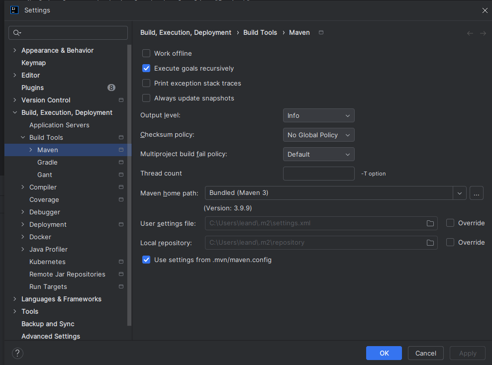
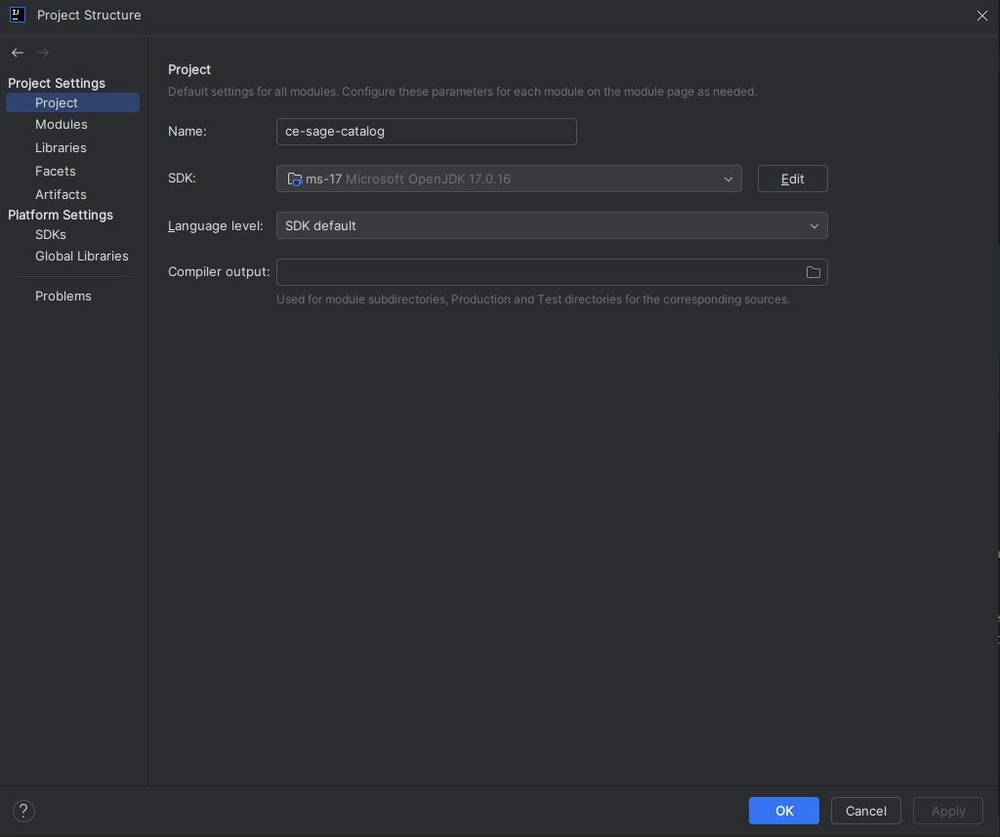
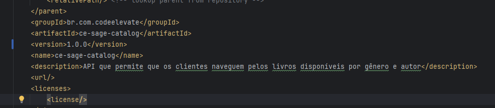
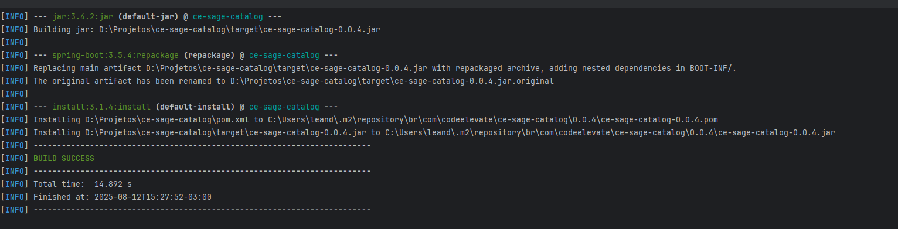
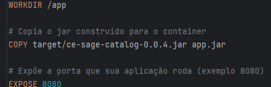
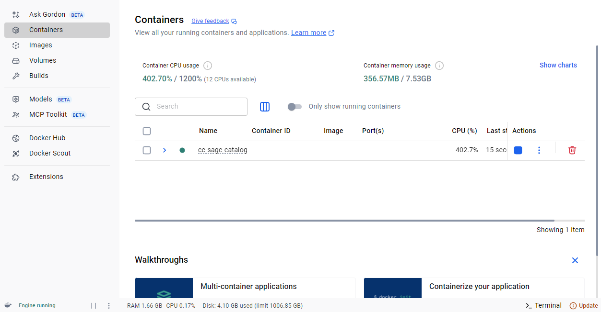
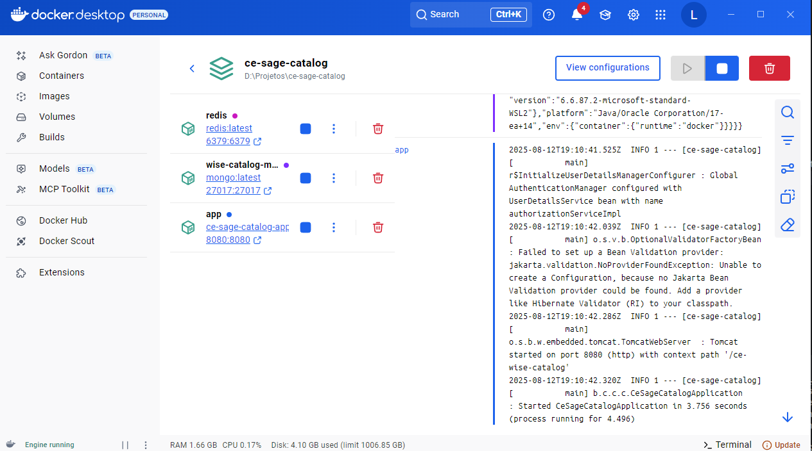
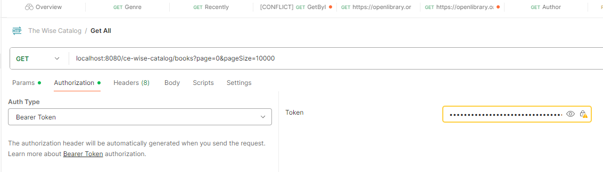

# O catálogo do Sábio (ce-wise-catalog)

O projeto consiste em uma API Restful, onde possibilita consultas de livros por autor, gënero e listagem de todos os livros cadastrados.
O projeto possui um endpoint de alimentação da base de dados, onde é possível cadastrar uma lista de livros por gênero.
Foi utilizado Java 17 + Spring 3 na implementação do sistema

### Design Pattern
O Design pattern da aplicação foi desenvolvido em uma arquitetura MVC (Model View Controller) onde a separação das camadas foi entre Model e Controller
Onde a controller é o intermédio entre view e model, é a camada em que recebe as requisições do usuário, View, a camada onde são apresentados os dados so usuário e Model, a camada que é responsável pela lógica e 
regras funcionais da aplicação.
É uma arquitetura simples, onde é fortemente recomendado a utilização em sistemas com integrações visuais (front-end).
### Organização de pastas
- A camada de controller, foi adicionada em uma pasta específica "controller"
- A cada de model, foi adicionada em uma pasta "service"
- A camada view não foi impolementada, pois não há desenvolvimento fron-end
- Pasta "client" foi adicionada para tratar chamadas externas ao projeto
- Pasta "client", adicionada para configurações de segurança, redis e restTemplate
- "exception.handler" para adicionar as tratativas de erros
- "model" para armazenar os objetos
- "reposutory" que contém as classes resposáveis por realizar conexões com o banco de dados

### Testes Unitários
Localizado na pasta /src/test/java/br.com.codeelevate.ce_sage_catalog
Para rodar os testes, clique com o botão direito na pasta "/src/test/java/br.com.codeelevate.ce_sage_catalog" e depois em "Run 'Tests in'ce_sage_catalog'"

O projeto encontra-se disponível no repositório do GitHub
[link] https://github.com/lkojima/ce-wise-catalog

### Pré-requisitos

Pré requisitos para rodar o projeto localmente em um container Docker
- Docker
- Git
- Maven 3.9.9 (versão indicada)

Opcional
- MongoDB Compass - utilizado como interface do mongoDB
- IntelliJ Community caso queira ter os logs da aplicação rodando. Ou pode acompanhar pelo próprio Docker Desktop

## Getting Started

### Clone do projeto
- Após instalação do git na sua máquina, vamos importar o projeto
- Abra o terminal da IDE, e digite o comando: git clone https://github.com/lkojima/ce-wise-catalog.git
- Após realizar o clone do projeto, selecione a versão que deseja ser trabalhada, no caso, a versão mais recente está localizada na branch release/1.0.0
- Para selecionar a branch desejada, podemos executar o comando "git checkout release/1.0.0"
### Vamos configurar o JDK e o Maven do projeto
#### Maven:
- Clique no botão "file" localizado no canto superior esquerdo do intelliJ e clique em "settings"
- Depois clique em "Build, Execution, Deployment"
- E depois em "Maven"
- Em seguida, no campo "Maven home path" podemos selecionar a pasta que esta localizado o maven ou selecionar o maven instalado nos plugins do próprio IntelliJ selecionando a opção Bundled (Maven 3) caso o maven seja superior a 3.9.9
- Nos campos "User Settings File" e "Maven repository", vamos selecionar a pasta .../.m2/repository, caso não possua esta pasta, ela pode ser localizada em Users/seu usuario/.m2
- Selecione nos dois campos a opção "Override"



#### JDK:
- Clique no botão "file" localizado no canto superior esquerdo do intelliJ e clique em "project structure..."
- Na lateral esquerda da janela aberta, localize "Project"
- em "SDK" selecione um SDK compatível com o projeto, no caso, versào 17.0.16, Em seguida, clique em "apply"
- CLique em "SDKs" e selecione o mesmo SDK que selecionou no passo anterior
- Clique em "apply" e "OK"



#### Configuração do redis e mongodb
Abra o arquivo docker-compose.yml, localizado na raiz do projeto.
Em seguida, repare que há duas configurações de dependencias que o projeto possui (redis e mongoDB)

Exemplo:

```yaml
  redis:
    image: redis:latest
    ports:
      - "6379:6379"
    volumes:
      - redis_data:/data

  wise-catalog-mongo:
    image: mongo:latest
    ports:
      - "27017:27017"
    volumes:
      - mongo_data:/data/db
```
Os parametros "ports" e "images" indicam qual porta você vai conectar com cada componente e a imagem que você vai baixar, no caso do exemplo, a imagem baixada vai ser a ultima versão encontrada.

### Crando imagem e Subindo no container Docker
#### Build do projeto
O primeiro passo é executar o comando "mvn clean install package" no seu terminal (precisa ser dentro da pasta do projeto).
Isso faz com que o .jar do seu projeto seja criado com a mesma versão que foi adicionado no pom.xmk



Depois de buildar o projeto, repare no console do build que ele gerou o .jar com a versão do projeto



E no arquivo "Dockerfile" devemos adicionar o path que o .jar está localizado com a mesma versão que o projeto foi construído



Após seguir os passos acima, estamos prontos para criar a imagem do projeto e subir ele no container.
Para isso, vamos executar o comando: "docker compose up --build" no terminal, dentro da pasta do projeto.

o Docker compose vai indenficar quais dependencias que o seu projeto tem, no caso, o mongoDB e o Redis,
após identificar as dependencias, vai baixar as imagens nas respectivas versões que foram declaradas no docker-compose.yml

Após o build do docker compose terminar, as imagens do redis, mongoDB e ce-wise-catalog estarão criadas no container, sendo visíveis no Docker Desktop

Container:


Imagens: 


Pronto! Sua aplicação está pronta para receber requisições com o host "localhost:8080/"

### Testando as funcionalidades
### Endpoints
A aplicação possui os seguintes endpoints:
#### Registro e Login
Para possuir acesso as funcionalidades, é necessário realizar o registro

- POST /ce-wise-catalog/auth/register - Deve ser enviado um body em formato raw JSON
```json
{
  "login": "lkojima",
  "password": "lkojima",
  "role": "ADMIN" //ADMIN ou USER
}
```
- POST /ce-wise-catalog/auth/login - Logar no sistema
    Deve ser enviado o um body em raw json
```json
  {
    "login": "lkojima",
    "password": "lkojima"
  }
 ```
Retorna um token de acesso, que dura 2 horas.

#### Consultas (TODAS as requisições requerem o token retornado no endpoint de login)
- GET /ce-wise-catalog/books?page=0&pageSize=10 - Retorna todos os livros cadastrados
- GET /ce-wise-catalog/books/author/{author} - Retorna todos os livros do autor informado
- GET /ce-wise-catalog/books/genre/{genre} - Retorna todos os livros por gênero
- GET /ce-wise-catalog/books/{id} - Retorna um livro por ID
- GET /ce-wise-catalog/books/recently - Retorna os últimos livros acessados

Para adicionar o token na requisição:


#### Insert
- POST /ce-wise-catalog/insert/books/{genre} - Insere todos os livros disponíveis em openlibrary (https://openlibrary.org/) por gênero

## Melhorias e Considerações finais
### Melhorias
- Adicionar as consultas através de cache em todas as requisições, principalmente na consulta de todos os livros utilizando uma chave única
- Caso o projeto fosse exposto, adicionaria mais camadas de segurança, api gateway e MTLS e também criaria secrets em keyvaults na Azure por exemplo, para guardar senhas, ids, secrets e clients
- Contruir um coletor batch, com propósito de inserir novos livros, verificando se novos livros foram inseridos no open library e mantendo o endpoint atual de inserção por gênero e adicionar um endpoint de inserção por título
- Novos endpoints para consulta contendo filtros mais inteligentes. Como por exemplo, consultar livros por titulo e editora
### Considerações finais
- Este projeto foi desenvolvido com intuito de facilitar consultas de livros, oferencendo uma API simples e flexível.
- Atualmente todos os requisitos foram atendidos, com possíveis melhorias, considerando os itens citados em "Melhorias"

## Author
  [Leandro Kojima](https://github.com/lkojima)

